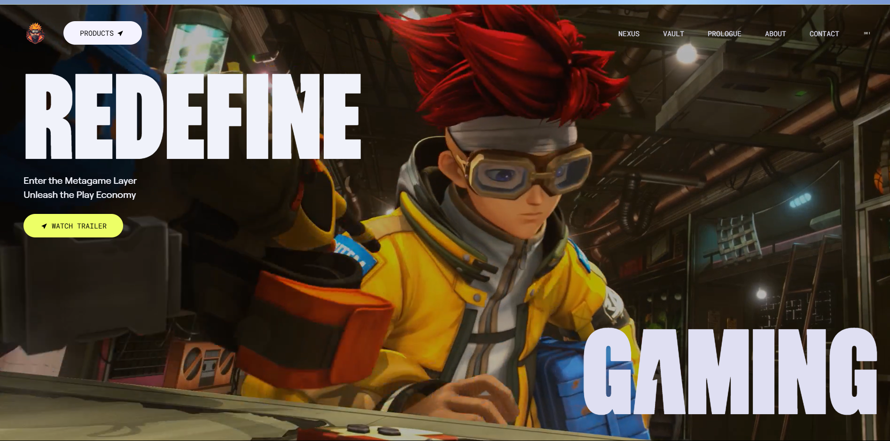

# 🕹️ Zentry Clone

A visually rich, animated React front-end inspired by [Zentry.com](https://zentry.com), simulating a next-gen gaming/metaverse platform. This project demonstrates advanced UI/UX, interactive animations, and a modular component structure using modern web technologies.

---

## ✨ Demo

> Add your project demo link or screenshots here  
> Example:  
> 

---

## 🚀 Features

- 🎮 Immersive hero section with animated video transitions
- 🧩 Modular, reusable React components (Hero, Features, Story, About, Contact, etc.)
- 🖼️ Bento-style feature cards with tilt and hover effects
- 🖋️ Animated titles and interactive UI elements
- 🎵 Audio playback toggle in the navbar
- 📱 Fully responsive and mobile-ready
- 🎨 Custom fonts and Tailwind CSS theming
- ⚡ Smooth GSAP-powered scroll and hover animations

---

## 🛠 Tech Stack

| Layer      | Tech                                  |
|------------|---------------------------------------|
| Frontend   | React, Vite, Tailwind CSS, GSAP       |
| Animation  | GSAP, Framer Motion (planned)         |
| Icons      | react-icons                           |
| Tooling    | ESLint, Prettier                      |

---

## 📂 Folder Structure

```
zentry-clone/
├── public/              # Static assets (audio, images, videos, fonts)
├── src/
│   ├── components/      # UI components (Hero, Features, etc.)
│   ├── assets/          # Project assets (screenshots, etc.)
│   ├── index.css        # Global styles (Tailwind, custom fonts)
│   └── main.jsx         # App entry point
├── index.html           # HTML entry
├── tailwind.config.js   # Tailwind config
├── vite.config.js       # Vite config
├── package.json         # Project metadata and scripts
└── README.md
```

---

## 🔧 Setup Instructions

```bash
# Clone the repository
git clone https://github.com/yourusername/zentry-clone.git
cd zentry-clone

# Install dependencies
npm install

# Start the development server
npm run dev

# Visit the app
http://localhost:5173
```

---

## 📝 Customization

- **Assets:** Replace images/videos in `public/` for your own branding.
- **Theme:** Edit `tailwind.config.js` and `src/index.css` for colors/fonts.
- **Components:** Extend or modify components in `src/components/` for new sections.

---

## 📈 Planned Improvements

- 🌐 Backend/API integration (authentication, real data)
- 🧠 More advanced animation and interaction logic
- 🛡️ Real ZTNA/Zero Trust simulation (future)
- 🧪 Unit and integration tests

---

## 🙋 Author

**Nitish Pathak**  
[GitHub](https://github.com/Nitish0943) · [LinkedIn](https://www.linkedin.com/in/nitish-pathak-935524260/)

---

## 📄 License

MIT License. See [LICENSE](./LICENSE) for details.
```
